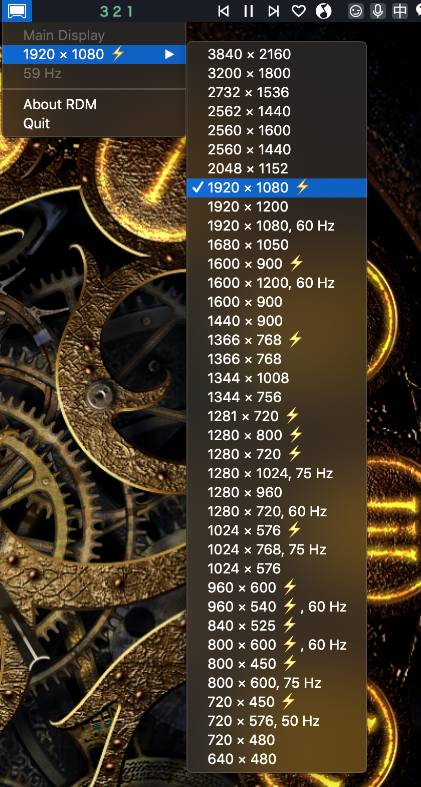

## 开启HiDPI

### [什么是HiDPI?](https://zhuanlan.zhihu.com/p/20684620)
### 由于macbook pro自带视网膜屏自带HiDPI，本章主要是外接显示器开启HiDPI的步骤。
### 步骤：
#### 1. 关闭SIP
- 重启，按住⌘ + R 进入恢复界面
- 左上角菜单里面找到终端，打开并输入
```bash
csrutil disable
```
- 回车并重启进入macOS，打开Terminal
#### 2. 开启macOS的HiDPI选项
```bash
sudo defaults write /Library/Preferences/com.apple.windowserver.plist DisplayResolutionEnabled -bool true
```
#### 3. 下面的两个命令会返回两个带10进制数字的结果，记下来，转换成16进制数字，其中第一个是用来命名文件夹的，第二个是用来命名文件的。( 2个结果的原因是1个是内置显示器，另一个是外接显示器 )
```bash
ioreg -l | grep "DisplayVendorID"
ioreg -l | grep "DisplayProductID"
```
#### 4. 在任意位置（桌面上比较好）建立一个文件夹，并在文件夹中命名一个文件，其中文件夹的名字为DisplayVendorID-XXX，文件的名字为DisplayProductID-XXX，XXX则是前面转换成16进制的两个数字。
#### 5. 文件的内容是一个plist格式的文件，内容如下，将DisplayProductID和DisplayVendorID改为刚才两条命令获得外接显示器的10进制数字。
```plist
<?xml version="1.0" encoding="UTF-8"?>
<!DOCTYPE plist PUBLIC "-//Apple//DTD PLIST 1.0//EN" "http://www.apple.com/DTDs/PropertyList-1.0.dtd">
<plist version="1.0">
<dict>
    <key>DisplayProductID</key>
    <integer>41156</integer>
    <key>DisplayVendorID</key>
    <integer>4268</integer>
    <key>scale-resolutions</key>
    <array>
        <data>AAAKAAAABaAAAAABACAAAA==</data>
        <data>AAAFAAAAAtAAAAABACAAAA==</data>
        <data>AAAPAAAACHAAAAABACAAAA==</data>
        <data>AAAHgAAABDgAAAABACAAAA==</data>
        <data>AAAMgAAABwgAAAABACAAAA==</data>
        <data>AAAGQAAAA4QAAAABACAAAA==</data>
        <data>AAAKAgAABaAAAAABACAAAA==</data>
        <data>AAAKrAAABgAAAAABACAAAA==</data>
        <data>AAAFVgAAAwAAAAABACAAAA==</data>
    </array>
</dict>
</plist>
```
#### 6. 把整个文件夹拷贝到/System/Library/Displays/Contents/Resources/Overrides/
#### 7. [下载并安装RDM22](https://github.com/avibrazil/RDM)，重启后用RDM选择带闪电符号的HiDPI分辨率即可。

